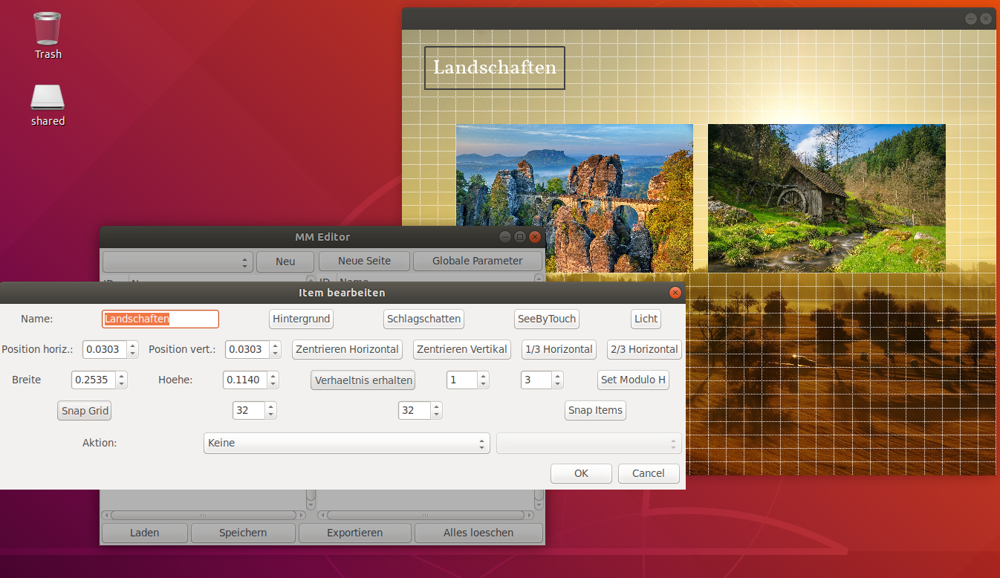
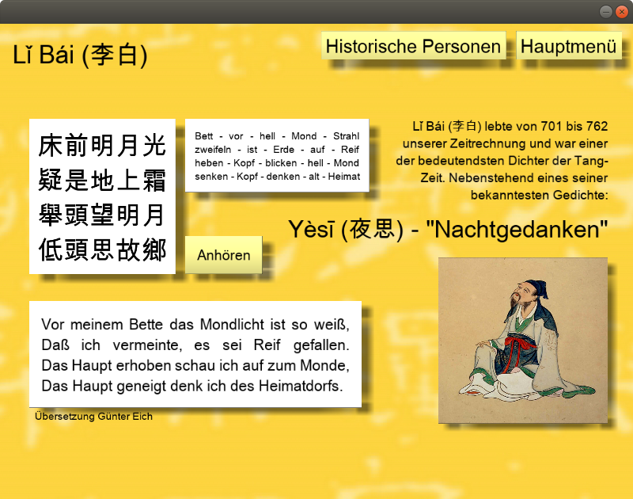
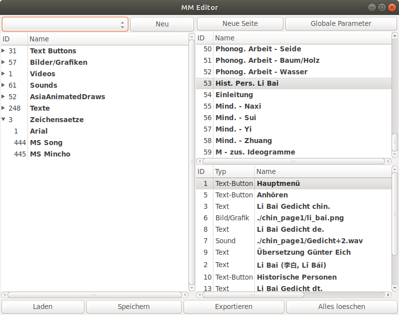
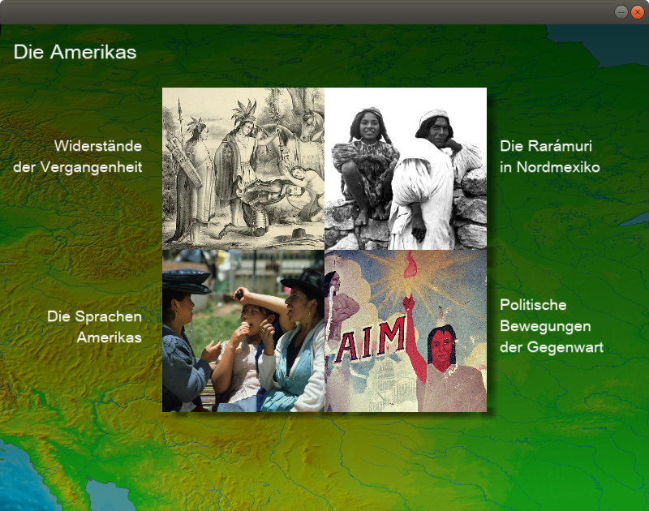

# MM

MM is a multimedia framework that I developed in 2007 to build interactive touchscreen terminals in museums. It has many features, it is quite powerful, but also very hacky and buggy. MM is based on SDL, OpenGL and has an interactive GTK editor. It displays pictures and texts, plays digital videos and sounds. Even the rendering of 3D models has been prepared. All elements can be animated in 3D by the OpenGL. It also has an interface to some special devices with which blind people can interactively capture digital images by moving a Braille display.

Be warned: I uploaded this software for documentation purposes. If you want to use it, be better prepared to fix many bugs and hacks.

Screenshot Editor

Screenshot Museum für Völkerkunde Leipzig

Screenshot Museum für Völkerkunde Leipzig

Screenshot Museum für Völkerkunde Leipzig
